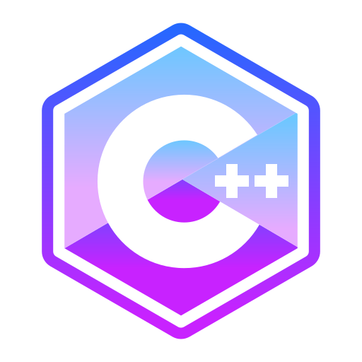

<h1 align="left">Hey 👋</h1>

My name is Nikhil Saxena and I'm a Fullstack Developer.

<h2 align="left">About me</h2>

📚 I'm currently pursuing B.Tech from KIET Group of Institutions.

<h2 align="left">I code with</h2>

###
Languages

  
  
  
  
  
  
  

###
Frontend

  
  
  

###
Backend

  
  
  

###
Database

  
  
  

